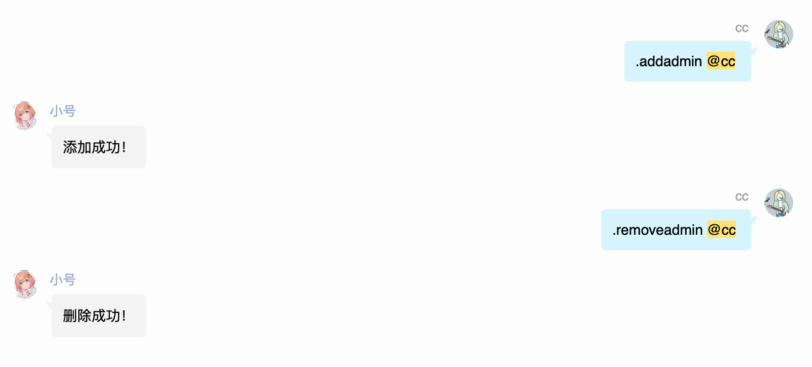
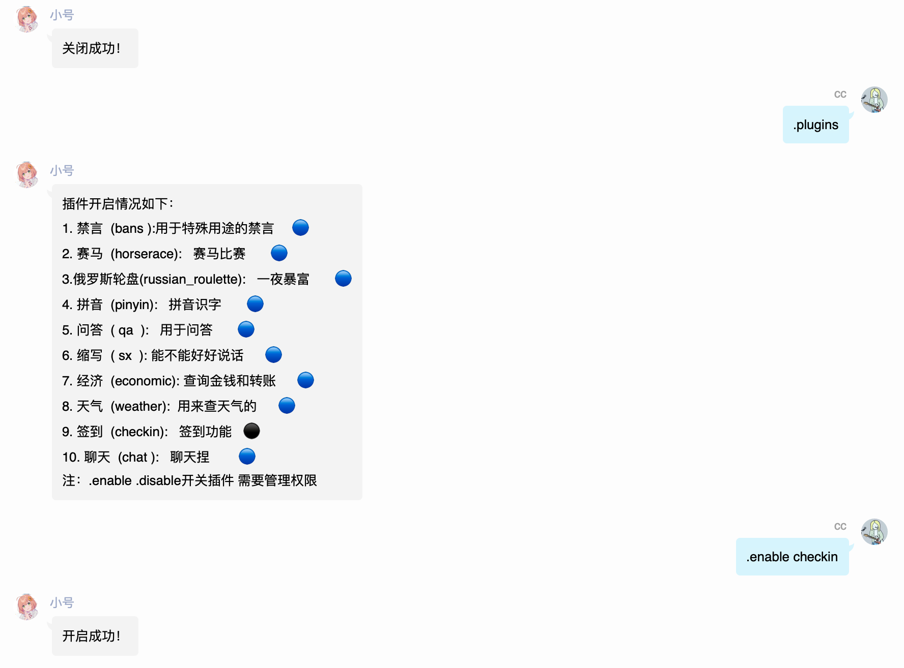
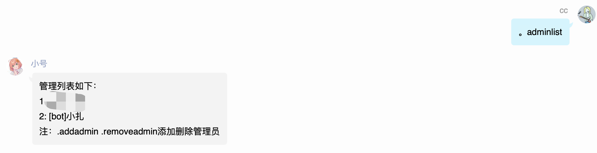
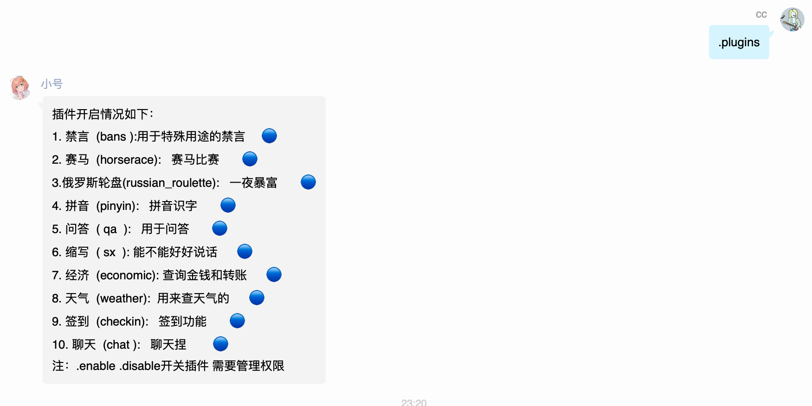

# 群管理插件

本插件主要用于管理群内插件的插件

:::tip
本章节所有指令均需要管理员权限且本章节部分指令所需要的管理权限区分于qq群内自带管理。

**为方便表述简写为插件管理和qq群管理。**
:::

## 添加管理员

插件管理区分于qq群管理，一般是用于游戏开启或者群内撤回(未完成)，需要qq群内管理添加和删除。

### 使用格式

```
。addadmin @添加人
```

也支持同时添加多人

```
.addadmin @n1 @n2......
```

## 删除管理员

### 使用格式

```
。removeadmin @n1 @n2......
```



## 启用插件

::: tip
插件管理和群管理均可使用此功能
:::

::: warning
插件名称必须为英文名，获取插件英文名请使用[插件状态](#插件状态插件列表)指令。
:::

```
。enable checkin
```

## 停用插件

```
。disable checkin
```



## 插件管理员列表

本指令无任何参数。

```
。adminlist
```



:::tip
此指令仅限群管理
:::

## 插件状态/插件列表

:::tip
此指令所有人均可使用
:::

️🔵代表启用，⚫代表关闭。

```
。plugins
```

```
。插件状态
```



## 帮助

```
。help
```

```
。菜单
```

```
。帮助
```

机器人被风控中 暂时没有截图<Badge type="tip" text="待定" vertical="top" />