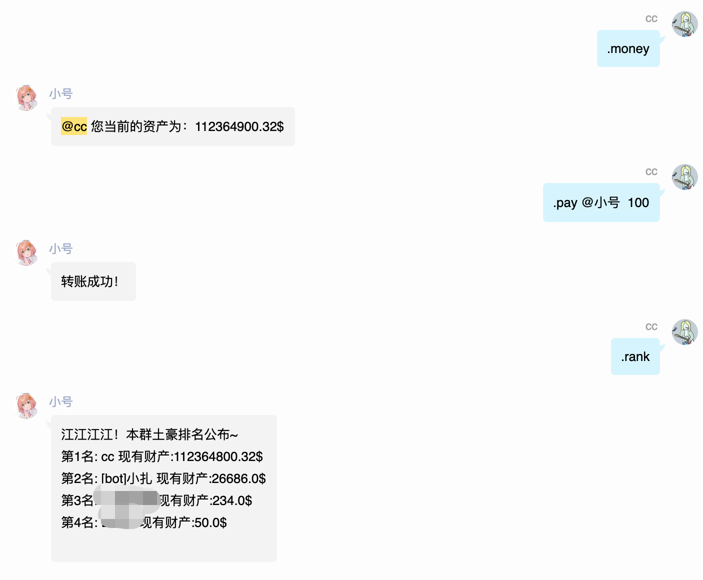

# 资产插件

看看自己有多少钱捏。

## 我的资产

```
。我的资产

。我的财产

。余额
```

## 资产排名

```
。rank
```

```
。排名

。排行
```

## 转账

本指令支持多人转账。

```
。pay @目标 金钱
```

```
。转账 @目标1 金钱1 @目标2 金钱2
```

## 添加金钱

:::danger
此指令仅限超级管理员使用，超级管理员仅可以在配置文件中更改。

本指令随意使用可能会造成经济崩坏。
:::

```
。addmoney @目标 金钱数
```

