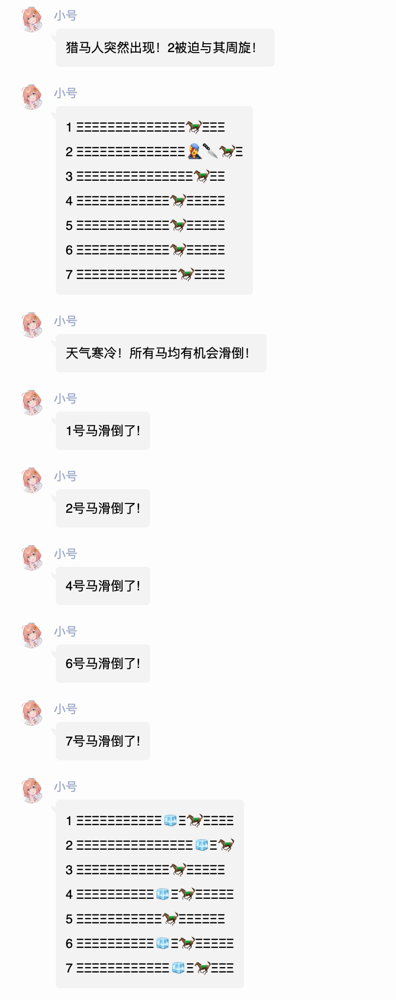
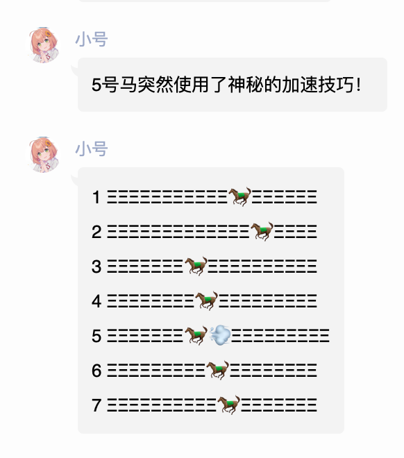
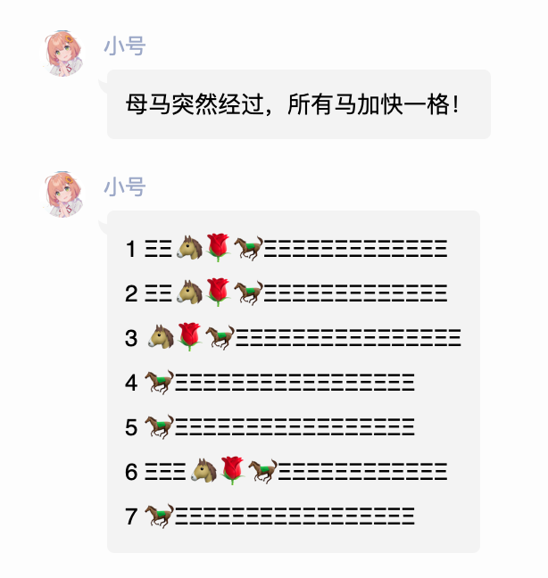
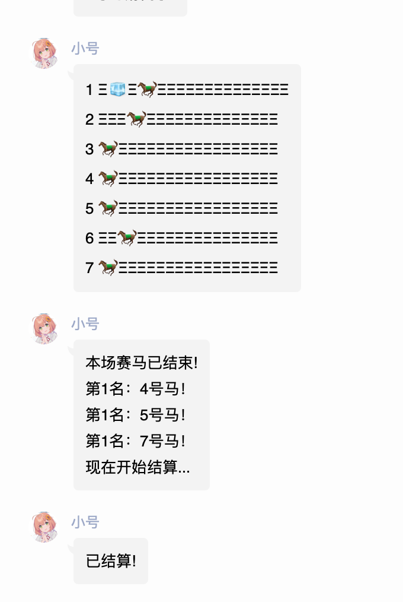
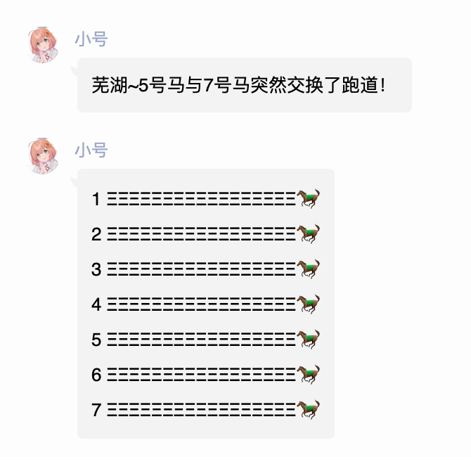

# 赛马插件

为了给群友来点乐子而设计的插件。

## 准备赛马

```
。horseready
```

```
。赛马

。准备赛马
```

开启新的一局赛马比赛。

> 赛马(beta0.3)
> 押这只马人数<=押其他马人数+1时：
> 奖励=赔率x下注金额
> 押这只马人数>押其他马人数+1时：
> 奖励=[100%+(赔率-100%)x（押其它马的人数/押马总人数）]x下注金额
> 输入 押马 x,y（x为数字，y为押金，如：押马 1,2）来选择您觉得会胜出的马，一人只能押一只
> 输入 开始赛马 开始比赛
> 注意：开始比赛后不能再选马
> 注意：只有前三只到达终点的马会根据名次获得获胜奖励（排名并列的情况下可能超过三只）押马有1%手续费

## 押马

```
。押马 1，100

。押马 2,200
```

编号和下注之间用`，`和`,`均可。

## 开始赛马

```
。startrace
```

```
。开始赛马
```

开始本局赛马。










